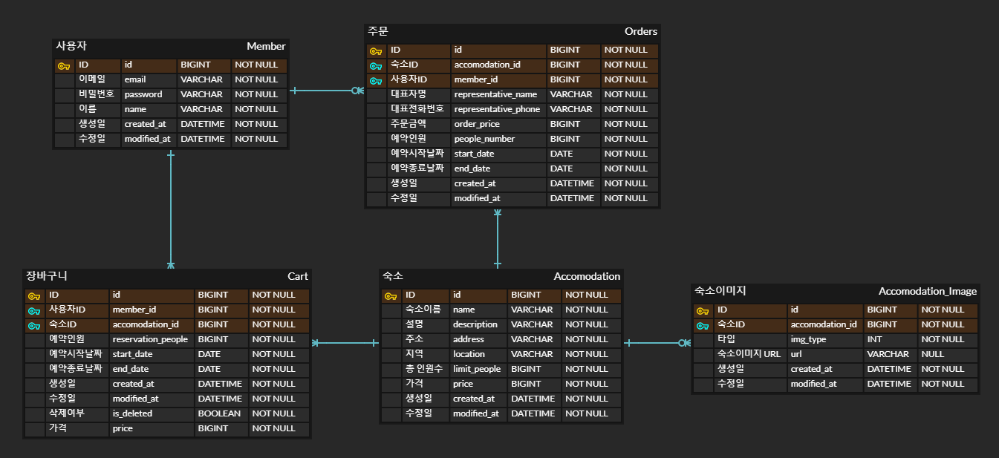
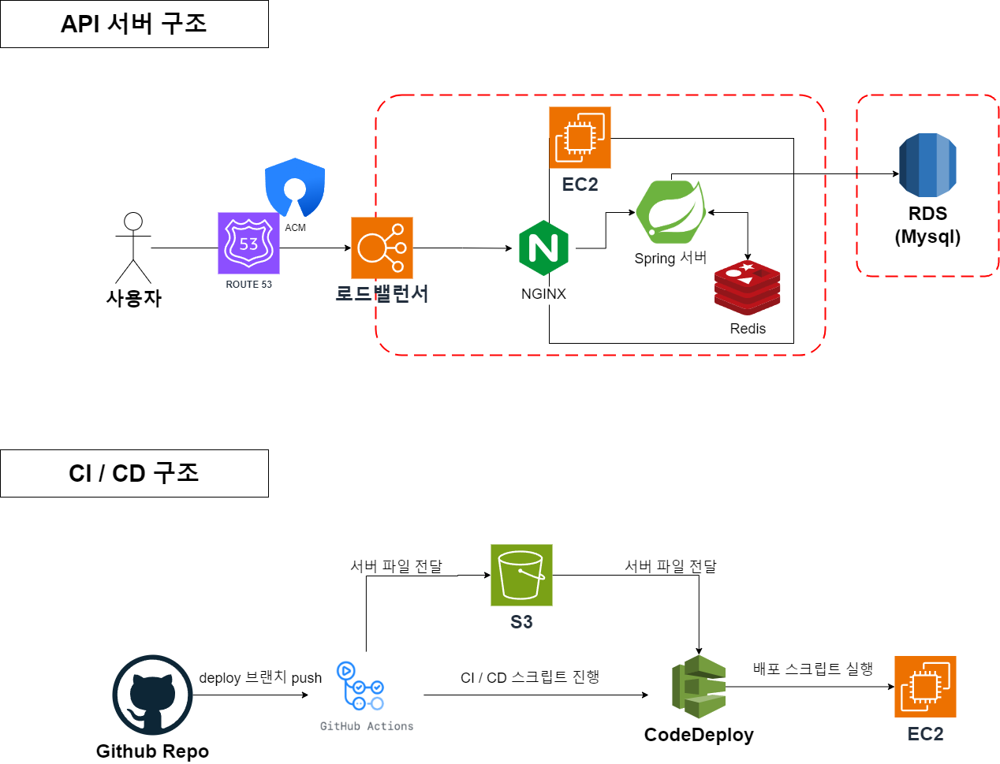

# 미니 프로젝트 : 숙박 예약 API 서비스

## 💡 프로젝트 주제

- **숙박 예약 서비스 API 서버 개발**
- 회원이 서비스를 로그인하여 상품의 숙소들을 확인할 수 있으며 주문하고 싶은 상품들을 장바구니에 담을 수도 있으며 ,주문을 할 수 있도록 만든 서비스

## 📝 프로젝트 요약

실제 숙박 예약을 하는 어플로서 로그인하여 주문 및 장바구니 담기 등을 진행할 수 있으며, 상품 전체 리스트 조회와 숙소 하나의 상세 정보도 보여줄 수 있다.
비회원인 경우 어떤 숙소가 있는지 구경할 수 있다.

## ⭐️ 핵심 기능

### 회원

- 사람들이 자신의 아이디를 만들어 로그인할 수 있다.
- 로그인 시간에 만료 시간을 두어 일정 시간이 지나면 서비스 사용을 위해 재로그인을 해야 한다.
- 아이디와,비밀번호를 통하여 인증을 진행하며 일치하지 않을 경우 서비스 사용을 할 수 없다.

### 주문

- 숙소들을 주문하여 예약할 수 있다.
- 나의 예약 내역을 불러와 확인할 수 있다.
- 숙소의 지정 날짜가 예약이 가능한지 확인할 수 있다.

### 숙소

- OPEN API를 통하여 데이터를 가져와 필요한 숙소의 정보들을 데이터베이스에 파싱하여 저장한다.
- 메인화면에 카테고리(지역)별 숙박 정보를 제공한다.
- 숙박에 대한 상세정보 페이지를 제공한다.

### 장바구니

- 장바구니에 숙소 내역을 담을 수 있다.
- 장바구니에 담은 내역을 삭제할 수 있다.
- 장바구니에 담은 내역이 품절이 된 지 아닌지를 알 수 있다.

## 🎢 실행 결과 화면

[실행 결과 화면 링크](/docs/RUNNING_SCREEN.md)

## ✨실행환경 설정 방법

- **`.env` 파일을 만들어야 합니다.**
- env 파일은 다음 [env 예제 파일(`.env.example`)](/.env.example)의 형식을 참고해주세요.

  ```properties
  # MYSQL 설정
  # !주의: USERNAME에 root를 입력하시면 안됩니다. root 외의 다른 이름을 입력해주세요.
  LOCAL_MYSQL_USERNAME=<MySQL의 DB username> 
  LOCAL_MYSQL_PASSWORD=<MySQL의 DB password>
  LOCAL_MYSQL_VOLUME_PATH=./bin/mysql # MySQL 데이터를 저장할 본인 컴퓨터 경로
  LOCAL_MYSQL_URL=localhost # 컴퓨터에서 사용할 MySQL URL
  LOCAL_MYSQL_PORT=3306 # 컴퓨터에서 사용할 MySQL PORT

  # JWT 설정
  JWT_SECRET_KEY=<your-jwt-secret-key> # BASE64로 인코딩된 JWT 시크릿 키
  JWT_ACCESS_EXPIRATION=36000000 # 액세스 토큰의 만료시간 (기본 1시간)
  JWT_REFRESH_EXPIRATION=864000000 # 리프레시 토큰의 만료시간 (기본 24시간)

  # Redis 설정
  LOCAL_REDIS_VOLUME_PATH=./bin/redis # REDIS 데이터를 저장할 본인 컴퓨터 경로
  LOCAL_REDIS_PORT=6379 # 컴퓨터에서 사용할 REDIS PORT

  # Open API Key 설정
  PORTAL_API_KEY=<your-open-api-key> # 개인의 Open API key (/v1/accommodation/data 호출시에만 필요)
  ```
  
- **docker compose를 사용하여 mysql과 redis 데이터베이스 환경을 만들어야 합니다.**
    - 인텔리제이의 docker plugin 기능을 사용하시거나, 다음 명령어를 입력해서 데이터베이스 환경을 구성하세요.
  
  ```bash
  docker compose up
  ```

## 🧑‍🤝‍🧑 조원 & 역할

| 이름  | 역할                             |
|-----|--------------------------------|
| 임경민 | 조장, 주문 도메인 개발, 팀 내 이슈 관리       |
| 한상우 | 회원 도메인 개발, 서버와 DevOps 설정 관리    |
| 박건우 | 장바구니 도메인 개발, Swagger API 문서 관리 |
| 문창호 | 숙박 도메인 개발, OpenAPI 데이터 관리      |

## 🚀 프로젝트 일정

- **프로젝트 기간**: 11월 20일(월) ~ 11월 30일(목)
- [프로젝트 간트 차트 링크](https://github.com/orgs/FAST-gamsungcoding/projects/1/views/2?query=is%3Aopen+sort%3Aupdated-desc)

## 🛠️ 개발 환경

- 자바 버전 : **17**
- 스프링 버전 : **Spring Boot 3**
- 데이터베이스 : Mysql, Redis (+ docker-compose)
- 문서화 도구 : Swagger
- 의존성(자세한 내용은 [build.gradle](./build.gradle)을 참고해주세요!)
    - Data-JPA
    - Data-Redis
    - QueryDSL
    - Validation
    - Security
    - Lombok
    - jjwt

## ⚙ API 문서

### Swagger

API 문서는 [**실제 구동 테스트 서버**](http://api.gamsung.xyz/swagger-ui/index.html)에서 확인해 보실 수 있습니다.

또는 프로젝트를 다운로드 받으신 후 서버를 구동한 뒤, 다음 링크의 Swagger UI에서도 확인해 보실 수 있습니다.

```
http://localhost:8080/swagger-ui/index.html
```

## 📐 ERD 설계도

[ERDCloud 사이트 링크](https://www.erdcloud.com/d/jvAPuL7Xrpk3Cnysf) 에서도 확인해보실 수 있습니다.



## 🏗 API 서버 구조 & CI/CD 구조



